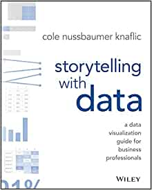

_"Graphical excellence is that which gives to the viewer the greatest number of ideas in the shortest time with the least ink in the smallest space"_

_-Edward R. Tufte_


### Introduction

As statisticians, mathmeticians and data scientists we are facinated by the complex and the intricate. Unfortunately, most of the business partners we will have do not share the same data and analytics literacy, and our visuals need to cater to _their_ ability to understand and build insights out of our analyses. On the bright side, if we can simplify our insights for our business partners, we generally come to understand our own analyses and data more completely!

### Building a Visual

To that end, good data visualization/exploration from analysis consists of three steps:

__Step 1: Visualize complex relationships (for your eyes only)__

 * Scatter plots
 * Histograms
 * boxplots
 * any plot with more than 3 dimensions (x axis, y axis, color, size, etc.)


__Step 2: Simplify plots for ease of interpretability (for data scientists only)__

 * Line graphs
 * Bar plots
 * Donut charts


__Step 3: Further simplify, edit and annotate plot to call out most important insights (for end user)__

 * Use color and accents to call out data
 * Use text to call out major data points
 * Label the plot to help the audience see what you want them to see
 * Take out as many distractions from the plot as possible

You'll notice that I blend these three steps together as I work. I start with a rough plot, and then I work on refinements of my plots as I go until I end up with the plot I want at the very end. 

### Plotting in R

R has some first-class packages to help us build plots that can be as comprehensive and complex as we'd like them to be, or as simple and clear as we need them to be. We will use the popular `ggplot2` package and some add-on packages that extend the capabilities of `ggplot2`.

__Capabilities of `ggplot2`:__

  * Layers: `ggplot2` builds plots using layers (e.g. background theme, axes, labels, color scheme, etc.). This makes it really easy to edit and refine plots and it also allows us to be very flexible with how we build our plots.
  * Plot Types: `ggplot2` in its most basic form can do most if not all standard plot types (histograms, scatter plots, line graphs, etc.). You can see what ggplot offers in terms of plotting options by typing `?geom_` + Tab. 
  * Dimensions: While we want to keep our plots simple for the user, we have several dimensions to play with that can help improve our understanding of the data. These are called using `aes()` (aesthetics) within ggplot.
    * x-axis (`x`)
    * y-axis (`y`)
    * color (`color` or `fill`)
    * size (`size`)
    * line type (`linetype`)
    * text (`label`)
    * transparency (`alpha`)
  
We aren't going to be able to go through all of these today, but I encourage you to check out the 
[ggplot2 gallery](https://www.r-graph-gallery.com/ggplot2-package.html) to get more ideas on the capabilities of ggplot. _A warning: most of these plots are far too advanced to present to business partners, but it can give you inspiration and you can simplify further from there._ 

Let's get started!


### Case Study: Customer Conversions

Let's say we have customers that we did some segmentation on and then sent ads to these customers based on their segmentation. We modeled the customers' "conversion" which in this case means that they purchased the product. To model this we use several predictors, but what we are most interested in is how many ads were delivered and how much of their conversion could be attributed to those ads that were delivered. With this information, the business wants to optimize who they send their ads to and with what frequency should they send them. We have a data set that has ad impressions over time, the impact on the customer's purchase, and the optimal number of ads based on a marginal ROI calculation (we won't get into the math here, the output of the modeling will be enough for our purposes).


#### Exploring the data

Load the packages...

```{r, message = FALSE}
# library(readr)
# library(dplyr)
# library(tidyr)
# library(ggplot2)
library(tidyverse)

```

Load the data...

```{r}
conversion <- read_csv("data/conversion.csv")

head(conversion)
```

Now that we have the data, let's take a look at conversion based on segment.

We start a plot with `ggplot` and some data to reference, and we add layers using `+`.

```{r}

p <- ggplot(data = conversion)

p + 
  geom_point(mapping = aes(x = ad_exposure, y = conversion_lift))

```

Right now, all I see that there may be some correlation between ad exposure and customer conversion. What else do you want to know?


Split this plot by segment?
```{r}
p + 
  geom_point(mapping = aes(x = ad_exposure, y = conversion_lift, color = segment), alpha = 0.1) + 
  facet_wrap(~segment)
```

How many ads are customers in each segment getting?
```{r}
p + 
  geom_histogram(aes(x = ad_exposure)) + 
  facet_wrap(~segment, scales = "free_y")
```

Okay, I'm sick of this grey background. I'm going to update it to be a bit more visually appealing and take away some of the clutter. 

```{r}
my_theme <- 
  theme_bw() + 
  theme(
    plot.title = ggplot2::element_text(face = "bold"), 
    axis.title = ggplot2::element_text(face = "bold"), 
    plot.caption = ggplot2::element_text(face = "italic"), 
    strip.background = ggplot2::element_blank(), 
    strip.text = ggplot2::element_text(face = "bold"), 
    panel.border = ggplot2::element_blank(), 
    axis.ticks = ggplot2::element_blank(), 
    panel.grid.minor.x = ggplot2::element_blank(), 
    panel.grid.major.x = ggplot2::element_blank(), 
    panel.grid.minor.y = ggplot2::element_blank(), 
    legend.title = ggplot2::element_text(face = "bold")
  )

p + 
  geom_histogram(aes(x = ad_exposure)) + 
  facet_wrap(~segment, scales = "free_y") + 
  my_theme
```

Let's look at ad exposure and conversion by segment over time. Can we see any groups out performing others? 
```{r}
segment_over_time <- 
  conversion %>%
  group_by(month, segment) %>% 
  summarize(
    total_conversions = sum(conversion_lift), 
    total_ads = sum(ad_exposure)
  )

segment_over_time %>% 
  pivot_longer(cols = total_conversions:total_ads, names_to = "metric", values_to = "value") %>%
  group_by(month, metric) %>% 
  arrange(desc(segment)) %>% 
  mutate(
    pct = value / sum(value),
    label_pct = scales::percent(pct, accuracy = 1),
    label_y = cumsum(value) - (value / 2)
  ) %>% 
  ggplot(aes(x = month, y = value, fill = segment)) +
  geom_bar(stat = "identity") + 
  geom_text(aes(y = label_y, label = scales::percent(pct, accuracy = 1)), color = "#FFFFFF", alpha = 0.8, fontface = "bold", size = 2.5) + 
  scale_fill_manual(values = viridis::viridis(50)[seq(5, 50, by = 10)]) + 
  facet_wrap(~metric, scales = "free_y") + 
  my_theme


```


This might be easier to see with a line graph...

```{r}
segment_over_time %>% 
  pivot_longer(cols = total_conversions:total_ads, names_to = "metric", values_to = "value") %>%
  ggplot(aes(x = month, y = value, color = segment)) +
  geom_line(size = 1.5, alpha = 0.8) + 
  scale_color_manual(values = viridis::viridis(50)[seq(5, 50, by = 10)]) + 
  facet_wrap(~metric, scales = "free_y") + 
  my_theme
```

How can we simplify this further? Should we do a calculation of conversions per ad exposed by segment?

```{r}
segment_over_time %>% 
  group_by(segment) %>% 
  mutate(
    conv_per_ad = total_conversions / total_ads,
    avg_conv_per_ad = ifelse(month == as.Date("2019-01-01"), mean(conv_per_ad), NA)
  ) %>% 
  # pivot_longer(cols = total_conversions:total_ads, names_to = "metric", values_to = "value") %>%
  ggplot(aes(x = month, y = conv_per_ad, fill = segment)) +
  geom_bar(stat = "identity", size = 1.5, alpha = 0.8) + 
  geom_hline(aes(yintercept = avg_conv_per_ad), linetype = "dashed", alpha = 0.8) + 
  scale_fill_manual(values = viridis::viridis(50)[seq(5, 50, by = 10)]) + 
  scale_x_date(date_labels = "%b") + 
  facet_wrap(~segment, scales = "free_x") +
  my_theme
```

This doesn't tell the whole story though, because the optimal number of ads may be more or less than what they are receiving. How do we visualize the optimal number of ads as well?

```{r}
conversion %>% 
  mutate(
    diff = optimal_number_of_ads - ad_exposure
  ) %>% 
  ggplot(aes(x = jitter(ad_exposure), y = jitter(optimal_number_of_ads), color = diff)) + 
  geom_point(alpha = 0.3) + 
  geom_abline(intercept = 0, slope = 1, linetype = "dashed", color = "red") + 
  facet_wrap(~segment) + 
  scale_color_viridis_c() + 
  my_theme
```


Okay, what do we know about our data now? What will help answer the question of where our ads should go and how frequently our customers should get them?  
  1. Segment 3 has the most total conversions.   
  2. Segment 2 converts really well for how few ads are delivered to them.    
  3. Segments 1, 4 and 5 all seem to be recieving more ads than they need to.  
  4. Segments 2 and 3 should probably be receiving more ads on average.  


#### Simplifying the problem

Right now, I think we have some decent plots that give us good information, but none of them are simple enough or ready for our marketing audience. The most important thing to show them is which customer segments need different ad frequency and how far off are they currently from maximizing profit. How can we simplify what we already have into something that would take 10 seconds to understand and would bring up all the right questions on actions that need to be taken?

Let's start by simplifying the data to only one or two observations per segment.

```{r}
conversion_summary <- 
  conversion %>% 
  mutate(
    diff = optimal_number_of_ads - ad_exposure
  ) %>% 
  group_by(segment) %>% 
  summarize(
    across(c(ad_exposure, optimal_number_of_ads, diff), sum), 
    n_customers = n_distinct(customer_id)
  ) %>% 
  ungroup() %>%
  mutate(
    avg_ads_per_cust = ad_exposure / n_customers, 
    opt_ads_per_cust = optimal_number_of_ads / n_customers
  )

conversion_summary

```


```{r}
final_plot <- 
  conversion_summary %>%
  pivot_longer(cols = avg_ads_per_cust:opt_ads_per_cust) %>%
  mutate(
    diff_label = case_when(
      name == "opt_ads_per_cust" & diff > 0 ~ paste0("+", diff), 
      name == "opt_ads_per_cust" & diff < 0 ~ paste0(diff)
    ), 
    diff_sign = ifelse(diff > 0, "positive", "negative")
  ) %>%
  ggplot(aes(x = segment, y = value, fill = segment, alpha = name)) + 
  geom_bar(stat = "identity", position = "dodge") + 
  scale_fill_manual(values = viridis::viridis(50)[seq(5, 50, by = 10)], labels = paste0("Seg. ", 1:5)) + 
  scale_alpha_manual(values = c(0.6, 0.9), labels = c("2019 Average", "Optimal")) + 
  scale_color_manual(values = c("#FE5748", "#83C355")) + 
  guides(color = FALSE, fill = FALSE) + 
  my_theme + 
  theme(
    legend.position = "top"
  ) + 
  labs(x = "", y = "Ads per Customer", alpha = "", 
       title = "How many ads should our customers receive to maximize profit?")
  
final_plot

```


```{r}
net_change_in_ads <- sum(conversion_summary$diff)

final_plot + 
  geom_text(aes(label = diff_label, color = diff_sign), fontface = "bold", vjust = -0.2, position = position_dodge(width = 0.9), show.legend = FALSE) + 
  geom_text(aes(label = scales::number(value, accuracy = 0.1)), position = position_dodge(width = 0.9), fontface = "bold", color = "#FFFFFF", vjust = 1.3, show.legend = FALSE) + 
  annotate("text", x = "Segment 4", y = 2.3, size = 3, hjust = 0,
           label = paste0("We can maximize profit with a net\nincrease of +", net_change_in_ads, " ads reallocated\nacross our existing customer base.")) + 
  labs(subtitle = "Number above bar represents the total ads needed to get to optimal.")
```

Great! Now we have a plot that can clearly tell marketers what needs to be done, big picture. You can further help them understand that your model can do this dynamically, and can help them to know who of their customers within each segment to target and with what frequency, but this plot allows them to see where changes need to be made without searching for the answer in the plot. 


### Conclusion

Hopefully this workshop gave you a chance to get your hands dirty with some visualization in `ggplot` and also helped you to simplify your thoughts and findings through visualization. This was a lot of information to process, so I will open it up for questions, and I will leave this final version in the repository for you to go through later if you'd like. If you are interested in making high-powered, clear visuals, I highly recommend you read _"Storytelling with Data"_ by Cole Nussbaumer Knaflic. It is a really easy read, and has helped me immensely to deliver better insights to my business partners, and thus add more value to them and to me. 


### Recommended reading: 

_Storytelling with Data: A Data Visualization Guide for Business Professionals_

_by Cole Nussbaumer Knaflic_

#


